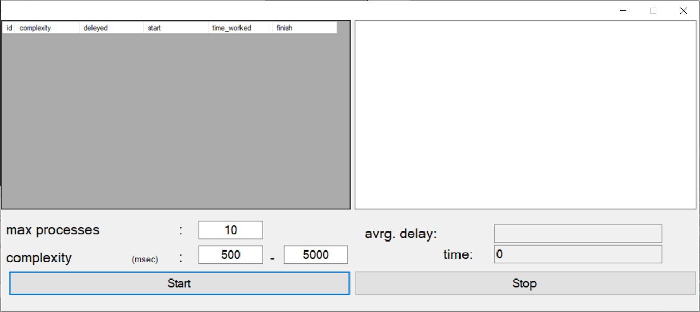
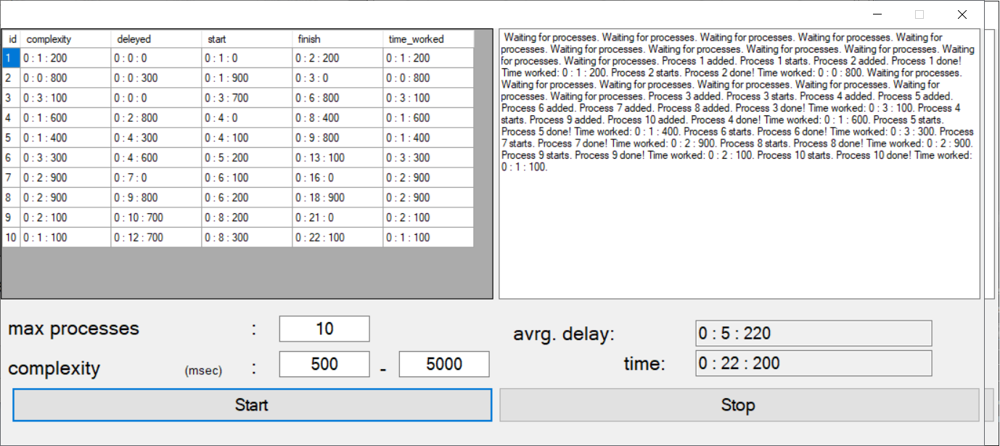
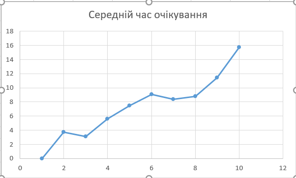
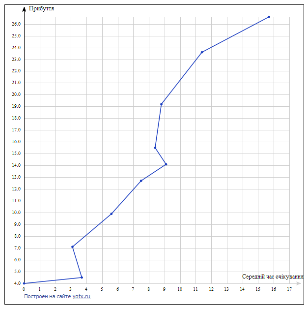

# ProcessManagerSimulator - FIFO Algorithm
A custom simulation of process manager written on C#
## DESCRIPTION
### Brief description
A test of implementing the basic work mechanic of processes managers (not actually implementing them).
Algorithm used - FIFO.
This is basically the Foreground Background algorithm. It suggests we have N queues. There the processes will be put on creating. 
Each process has a number associated with it, based on the actual order of the task appearance.
### FUNCTIONS 

We have `class Time` - simulator of clock, that contains methods:  `inc_min()`(increasing minutes), `inc_sec()`(increasing seconds), `inc_msec()`(increasing miliseconds)
We have `class Process` - simulator of process, that has such properties:`id`, `complexity`, `start`, `finish`, `time_worked`, `deleyed`, `state`. There can be many values of state like: 0 - default value, when process just created, 1 - process run or resume, 2 - process paused, 3 - process solved.
We have `ProcessGenerator class` thar creates new Processes by using random
In `ProcessManager class` we have `List<Process> processes_queue` (it is the queue of processes that wait to be done), `BindingList<Process> done_processes `(list of done processes) ,`run_next()` (method for solve process),  `gen_next()`(add new process to processes_queue list ), `all_done() `(check if all processes are done)
  
 
## DEMONSTRATION
> Create process manager and timer

### Code
```
  private Time cur_time = new Time();
  private ProcessManager manager = new ProcessManager();
```

> Create StartButton

### Code
```
private void startButton_Click(object sender, EventArgs e)
        {
            manager = new ProcessManager();
            processBindingSource.DataSource = manager.done_processes;
            dataGridView1.AutoGenerateColumns = true;
            dataGridView1.DataSource = processBindingSource;

            avDelayBox.Text = "";
            timerBox.Text = "0";
            logBox.Text = "";
            cur_time.reset();
            timer.Enabled = true;
            timer.Start();
        }
```
> Create ResetButton
### Code
```
private void resetButton_Click(object sender, EventArgs e)
        {
            timer.Stop();
        }
```

> Create Timer
```
private void timer_Tick(object sender, EventArgs e)
        {
            
            logBox.AppendText(manager.run_next(new Time(cur_time), timer.Interval));
            logBox.AppendText(manager.gen_next(Int32.Parse(minComp.Text), Int32.Parse(maxComp.Text), timer.Interval, cur_time, Int32.Parse(maxProcesses.Text), 0.1));
            if (manager.all_done(Int32.Parse(maxProcesses.Text))){
                timer.Stop();
                double sum_delay = 0.0;
                foreach (Process pr in manager.done_processes)
                {
                    sum_delay += pr.deleyed.ToMsec();
                }
                avDelayBox.Text = new Time((int)sum_delay / manager.done_processes.Count).ToString();
            }
            cur_time.inc_msec(timer.Interval);
            timerBox.Text = cur_time.ToString();    
        }
```
We fix value of complexity range (500;5000) and max_processes = 10,  you can easily change these values


## Output

This you can see how program works


This is a result of solving all processes


That a demonstration how you can stop processes solving 


Графіки:
Priority plot




Dependences between average waiting time and finish time


